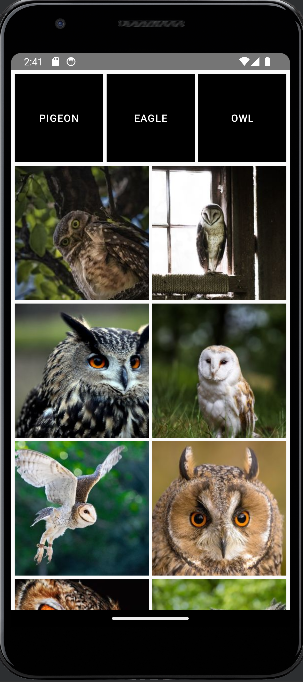

# Bird list app

This app was made to study how to use compose multiplatform.\
It consumes an API with bird pics and displays them in a list. Works both on android and IOS.\
it was made folowing Kotlin by JetBrains video as a guide: https://youtu.be/5_W5YKPShZ4

